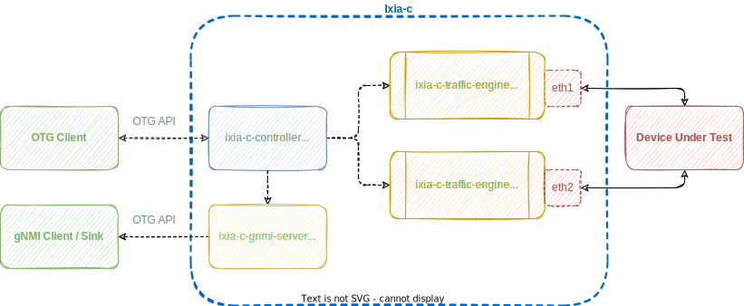
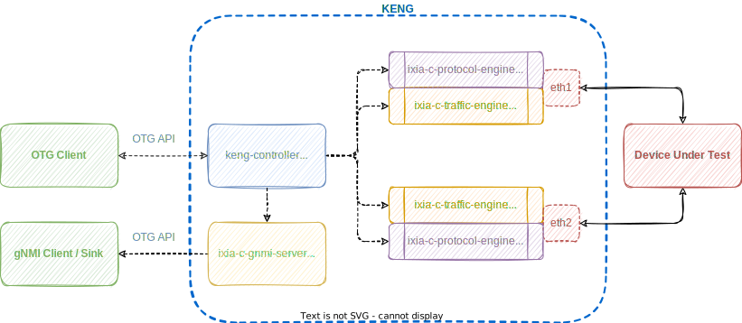

# Implementations

## Overview
To apply OTG in practice, an OTG-compatible tool, typically a Traffic Generator, is needed. There are several implementations available, and the list is growing:
 
* [**Ixia-c**](https://ixia-c.dev): containerized traffic generator from Keysight, with a Community Edition
* [**Keysight Elastic Network Generator**](https://www.keysight.com/us/en/products/network-test/protocol-load-test/keysight-elastic-network-generator.html): commercial offering of containerized Ixia-c Traffic Generator from Keysight
* [**IxNetwork**](https://www.keysight.com/us/en/products/network-test/protocol-load-test/ixnetwork.html): [snappi-ixnetwork](https://github.com/open-traffic-generator/snappi-ixnetwork) enables running OTG/snappi scripts with Keysight IxNetwork
* [**Magna**](https://github.com/openconfig/magna): open-source OTG implementation from [OpenConfig project](https://openconfig.net/)
* [**TRex**](https://trex-tgn.cisco.com/): [snappi-trex](https://github.com/open-traffic-generator/snappi-trex) enables running OTG/snappi scripts with TRex. Supports layer 2-3 Traffic Flows

## Ixia-c

[Ixia-c](https://ixia-c.dev) is a modern, powerful and API-driven traffic generator designed to cater to the needs of hyperscalers, network hardware vendors and network automation professionals.
 
It is available for as a free Community Edition as well as a part of a commercial Keysight Elastic Network Generator offering. Ixia-c is distributed / deployed as a multi-container application consisting of a controller, traffic and protocol engines, and an optional gNMI server.
 
As a reference implementation of Open Traffic Generator API, Ixia-c supports client libraries in various languages, most prevalent being snappi for Python and gosnappi for Go.

### Community Edition
 
Components of Ixia-c Community Edition are:

* **Ixia-c Controller** serves as an OTG API Endpoint over HTTPs and gRPC 
* **Ixia-c gNMI Server** exposes OTG Metrics over gNMI
* **Ixia-c Traffic Engine** controls Test Ports and is responsible for transmitting and receiving Traffic Flows

Fig. 1. Ixia-c Traffic Engine Deployment Diagram

Ixia-c Community Edition is limited to:

* Traffic Flows with **all capabilities**
* **Basic traffic performance** via raw Linux sockets
* **Up to 4** Test Ports in one session
* **No L2 protocols** on Test Ports
* Emulated Devices **without control plane protocols**
* Support via **Slack channel**

## KENG

[Keysight Elastic Network Generator](https://www.keysight.com/us/en/products/network-test/protocol-load-test/keysight-elastic-network-generator.html) (KENG) is a commercial of Ixia-c with added capabilities:

* **Accelerated traffic performance** via DPDK PCI
* **Unlimited number** of Test Ports per session
* Support of **L2 protocols** on Test Ports
* Emulated Devices **with control plane protocols**
* **Keysight Support** with SLAs
 
Components of KENG are:

* **KENG Controller** serves as an OTG API Endpoint over HTTPs and gRPC 
* **Ixia-c gNMI Server** exposes OTG Metrics over gNMI
* **Ixia-c Traffic Engine** controls Test Ports and is responsible for transmitting and receiving Traffic Flows
* **Ixia-c Protocol Engine** is responsible for L2-3 protocol emulation

Fig. 2. Keysight Elastic Network Generator Deployment Diagram

## IxNetwork

## Magna

## TRex

[**snappi-trex**](https://github.com/open-traffic-generator/snappi-trex) is a plugin that allows executing [snappi](https://github.com/open-traffic-generator/snappi) scripts with [TRex Traffic Generator](https://trex-tgn.cisco.com).

The plugin converts Open Traffic Generator configuration into the equivalent TRex STL Client configuration. This allows users to leverage TRex capabilities without having to write complex STL scripts. 

Fig. 3. OTG interface for TRex using snappi-trex plugin

The above diagram outlines the overall process of how the Open Traffic Generator API is able to interface with TRex and generate traffic over its network interfaces.

The snappi-trex plugin supports stateless **Traffic Flows** over **Test Ports**. For the full list of supported OTG capabilities, see [snappi-trex documentation](https://github.com/open-traffic-generator/snappi-trex/blob/main/docs/features.md).
