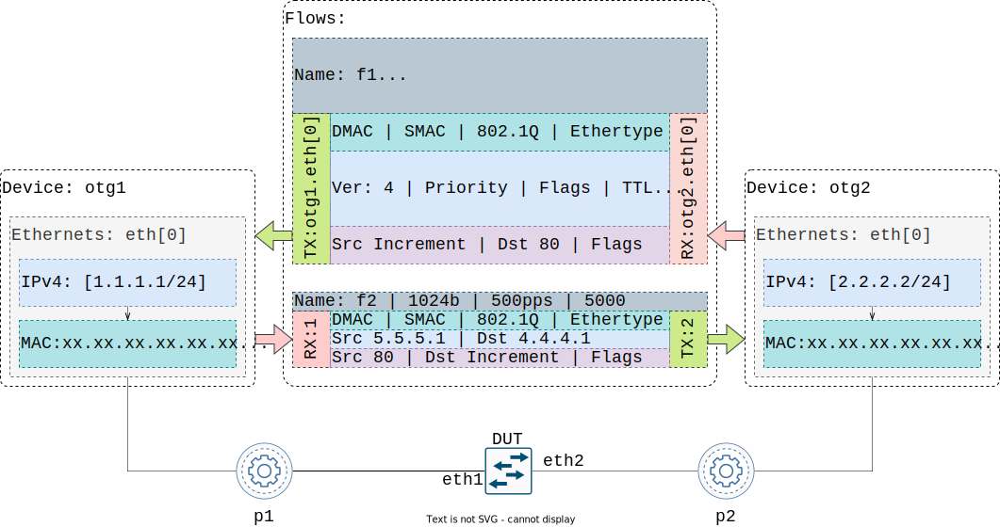

# Model

## Formal Model
The formal [model specification](https://github.com/open-traffic-generator/models/blob/master/artifacts/openapi.yaml) can be found on GitHub under [Open Traffic Generator](https://github.com/open-traffic-generator) organization. To explore the model, a viewer friendly [**ReDoc rendering**](https://redocly.github.io/redoc/?url=https://raw.githubusercontent.com/open-traffic-generator/models/master/artifacts/openapi.yaml) is available as well. The OTG APIs support both REST and gRPC interfaces.

## Building Blocks

OTG is an actively developing specification, with contributions from real [use cases](/examples/#use-cases). The model allows to express the following building blocks of a traffic generator configuration:

* **Test Ports** with Layer 1&2 capabilities, including:
	- LLDP, LAG, LACP
* Emulated **OTG Devices** with Layer 2&3 features:
	- IPv4, IPv6 interfaces
	- ARP, IPv6 ND
	- BGP, IS-IS routing protocols
* **Traffic Flows** 
    - associated with either Test Ports, or OTG Devices
	- expressing L2-4 properties like Ethernet, IPv4/IPv6, TCP/UDP
	- stateless or stateful capabilities for transport protocols
	- with implementation-specific application payload
* Run-time **Metrics** and traffic **Capture** capabilities

## Hierarchy

The hierarchy of objects the OTG Model is visualized below.
<!-- TODO replace with an image from the images subfolder -->

Fig. 1. Hierarchy of the OTG objects

##Raw Traffic Flows
 
In the most simple cases, the OTG Model describes **Raw Traffic Flows**: stateless streams of packets to be transmitted from one Test Port, and expected to be received on another Test Port.

Fig. 2. Configuration with Raw Traffic Flows

##Devices and Flows
 
Traffic Flows can also be associated with emulated **OTG Devices** to form 1:1 or mesh communications between them. Such approach allows to use the same Flow definition to originate traffic from multiple ports, as well as Link Aggregation Groups (LAGs).

Fig. 3. Configuration with Traffic Flows betweeb OTG Devices

##Devices and Protocols
 
The main role of **OTG Devices** is to emulate control plane protocols: BGP, IS-IS, and other protocols as the model evolves. This allows testing of protocol implementations by Device Under Test, and is also nessesary to for DUT to learn routes that would be needed to properly route Traffic Flows.

Fig. 4. Configuration with Traffic Flows betweeb OTG Devices running BGP

