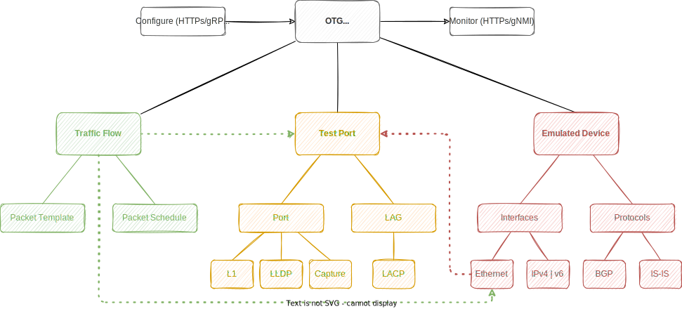
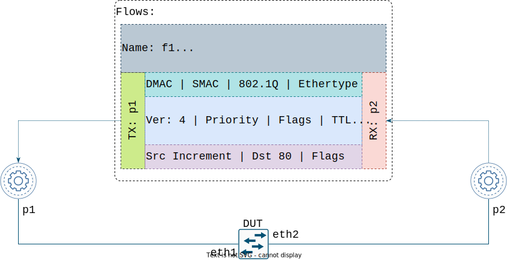
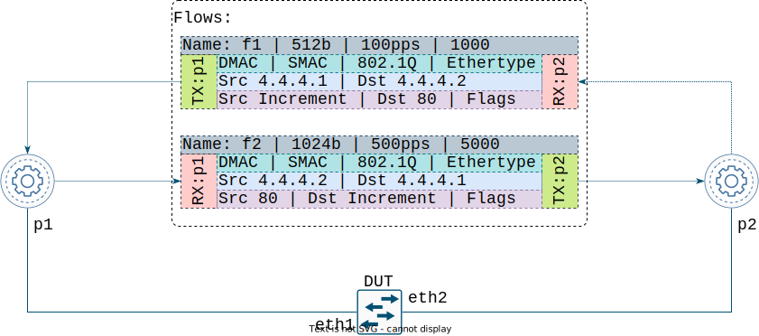
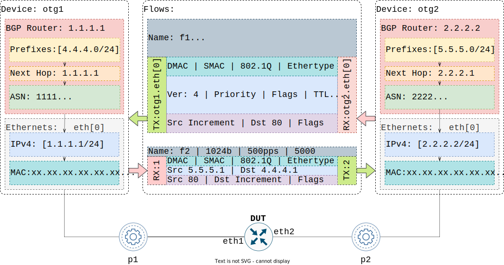

# Model

## Formal Model
The formal [model specification](https://github.com/open-traffic-generator/models/blob/master/artifacts/openapi.yaml) can be found on GitHub under [Open Traffic Generator](https://github.com/open-traffic-generator) organization. To explore the model, a viewer friendly [**ReDoc rendering**](https://redocly.github.io/redoc/?url=https://raw.githubusercontent.com/open-traffic-generator/models/master/artifacts/openapi.yaml) is available as well. The OTG APIs support both REST and gRPC interfaces.

## Building Blocks

OTG is an actively developed specification, with contributions from real [use cases](/examples/#use-cases). The model defines the following components of a traffic generator configuration:

* **Test Ports** with Layer 1&2 capabilities, including:
	- LLDP, LAG, LACP
* **Emulated Devices** with Layer 2&3 features:
	- IPv4, IPv6 interfaces
	- ARP, IPv6 ND
	- BGP, IS-IS routing protocols
* **Traffic Flows** 
    - associated with either Test Ports, or Emulated Devices
	- expressing L2-4 properties like Ethernet, IPv4/IPv6, TCP/UDP
	- stateless or stateful capabilities for transport protocols
	- with implementation-specific application payload
* Run-time **Metrics** and traffic **Capture** capabilities

## Hierarchy

The hierarchy of objects in the OTG Model is visualized below.

Fig. 1. Hierarchy of the OTG objects

##Raw Traffic Flows
 
In the most simple case, the OTG Model describes **Raw Traffic Flows**: stateless streams of packets to be transmitted from one Test Port, and typically, but not always, expected to be received on another Test Port. A configuration when a flow is not expected to be received, is called *one-arm*. Otherwise, it is a *two-arm* configuration.

Fig. 2. Two-arm configuration with a Raw Traffic Flow

Since Traffic Flows are unidirectional and stateless, a bidirectional communication can be expressed by two Traffic Flows transmitting on opposite directions.

Fig. 3. Configuration with two Raw Traffic Flows representing a bidirectional comminication

##Devices and Flows
 
Traffic Flows can also be associated with **Emulated Devices** to form 1:1 or mesh communications between them. Such an approach allows the use of the same Flow definition to originate traffic from multiple ports, as well as Link Aggregation Groups (LAGs).

Fig. 4. Configuration with Traffic Flows between Emulated Devices

##Devices and Protocols
 
The main role of **Emulated Devices** is to run control plane protocols: BGP, IS-IS, and more as the model evolves. This allows testing of protocols implementated by a Device Under Test (DUT), and is also nessesary for the DUT to learn routes that it would need to properly route Traffic Flows.

Fig. 5. Configuration with Traffic Flows between Emulated Devices running BGP

